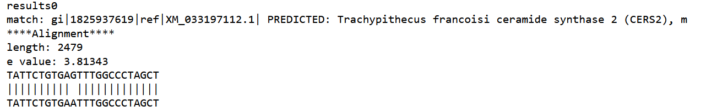

# Principle
The goal is to have an automatic pipeline that Blast a sequence agains NCBI databases.
We will use it to blast our potential candidates guide RNA to check where the there is alignments.
The analysis will be ran via python through the NCBI server

The principle is : 

- Open the sequence and transform the file type as an object 
- Call the Blast function with adjusted parameters
- Extract the results and filter them 

Usefull websites:
- [FAQ from NCBI](https://blast.ncbi.nlm.nih.gov/Blast.cgi?CMD=Web&PAGE_TYPE=BlastDocs&DOC_TYPE=FAQ#entrez)
- [Biopython function doc](https://biopython.org/docs/1.75/api/Bio.Blast.NCBIWWW.html)

# Limits
1.  The Expect Value Threshold default setting will be reduced to 0.05.
2.  The maximum number of target sequences (Max target sequences) limit will be no more than 5,000.
3.  The maximum allowed query length for nucleotide queries (blastn, blastx, and tblastx) will be 1,000,000 and 100,000 for protein queries (blastp and tblastn).
[source](https://ncbiinsights.ncbi.nlm.nih.gov/2020/06/18/new-blast-settings/)
4. Submitting searches on off-hours (8 pm to 8 am EST) may provide better throughput. Morning in european time. 
5. Multiple sequences (I tried 50 random and it didn't work)

# Pipeline in practice
As a "test" I generated random sequences using the script *generate_random_seq.py* I wrote: you give the number of sequences you want, the length and the name/path where you want to save it.

Right now I tried a different number of sequences that are 28 nucleotide long (just like the guide we will use)

## open a sequence file
```python
from Bio import SeqIO 

seq_record = SeqIO.read('sequences/test/ELF3.fa','fasta')
seq_record.seq 
```
## Open multiple sequences
```python
seq = list(SeqIO.parse('sequences/test/sequences.fa','fasta'))
seq[0].seq # to see one of the sequence
```
## Call the blast function
You need to have blast installed locally to be able to run it. You can find it [there](https://ftp.ncbi.nlm.nih.gov/blast/executables/blast+/LATEST/)

```python
from Bio.Blast import NCBIWWW

result_handle = NCBIWWW.qblast("blastn", "nt", seq[i].seq)

help(NCBIWWW.qblast) # to find description about the functions

```

The function takes multiples arguments that are listed on the NCBI website, but a summary of the main functions is available [here](https://biopython-tutorial.readthedocs.io/en/latest/notebooks/07%20-%20Blast.html#Running-BLAST-over-the-Internet)

## Call the balst function for multiple sequences:
```python 
result_handle = []

Entrez.email = 'ness.louafi@gmail.com' # identify yourself to the NCBI 

for i in range(len(seq)):
    print('Trying sequence number ' + str(i)+'...')
    result_handle.append(NCBIWWW.qblast("blastn", "nt", seq[i].seq, hitlist_size = 10))
    print('Done with sequence ' + str(i) + ' !')
```

## Visualization of the results
```python

for i in range(len(result_handle)):
    with open('results/results_test_'+str(i)+'.xml', 'w') as save_file: 
        blast_results = result_handle[i].read() 
        save_file.write(blast_results)

# I prefer to make it 2 loops because if you call the saving function twice it will erase the files... 

for i in range(len(result_handle)):
    for record in NCBIXML.parse(open("results/results_test_"+str(i)+".xml")): 
         if record.alignments: 
            print("\n") 
            print("results"+str(i))
            for align in record.alignments: 
                for hsp in align.hsps: 
                    print("match: %s " % align.title[:100])
                    #print('e value:', hsp.expect)
                    
    for alignment in record.alignments:
        for hsp in alignment.hsps:
            print('****Alignment****')
            print('length:', alignment.length)
            print('e value:', hsp.expect)
            print(hsp.query[0:75] + '   ')
            print(hsp.match[0:75] + '   ')
            print(hsp.sbjct[0:75] + '   ')
```
Will output something like


### Warnings
- Be carefull on the number of inquiries made to the NCBI server:
	- I tried 50 -> failed
	- I tried 5 successfull -> Success

# Optimization 
Try to make it faster and also it will deal with errors (sequences that don't blast) -> **WORK IN PROGRESS** 

```python
from Bio import Entrez
from urllib.error import URLError
import time

Entrez.email = 'ness.louafi@gmail.com'
counter = 0 
list_record_host = []
for record in SeqIO.parse("sequences/test/sequences_10.fa", format="fasta"):
    print(record.id)
    print(counter)
    counter+=1
    #print(record.seq)

    # online request
    try:
        result_handle = NCBIWWW.qblast("blastn","nt",record.seq, hitlist_size = 10)
        print(result_handle)
    except HTTPError:
        time.sleep(5)
        result_handle = NCBIWWW.qblast("blastn","nt",record.seq, hitlist_size = 10)

    # result handle stored in a list
    list_record_host.append(result_handle)
```

Make a window pop up when the script is done running-> **WORK IN PROGRESS** 

```python
import webbrowser
webbrowser.open_new('http://localhost:8888/notebooks/Documents/iGEM/iGEM/Run%20BLAST.ipynb')
```

# Outlooks
- I want to try to make functions out of all the snippets above to make the code more automatic and easily customable
- I want to try to have an automatic filtering system of the results to have directly the "interesting results" i.e the ones from the organisms that could be found in the watter
- If we have access to a Thau transcriptome:
	- If it is online :
		- Scrap the website to gather the dataset (temporarly)
		- run BLAST locally, faster because no need to send it to the NCBI
		- save the output and loop over all the dataset
	- If we can get the dataset -> easiest:
		- Run the pipeline directly and filter the results

- Maybe try to run the pipeline with a sequence : scaffold for Cas13a + random sequence(spacer) 
